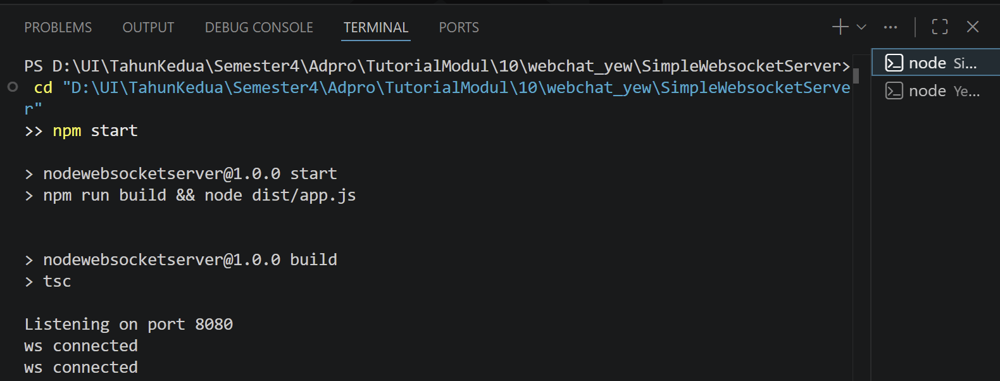
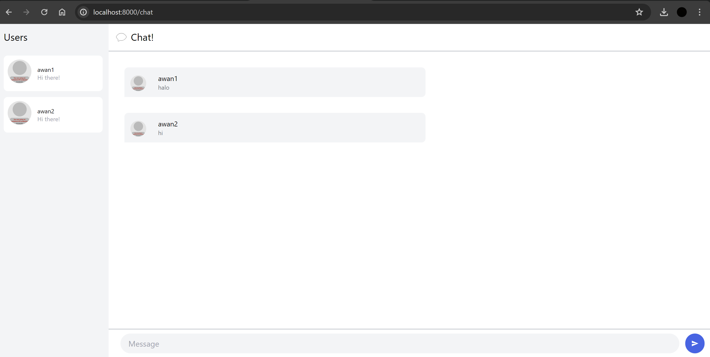
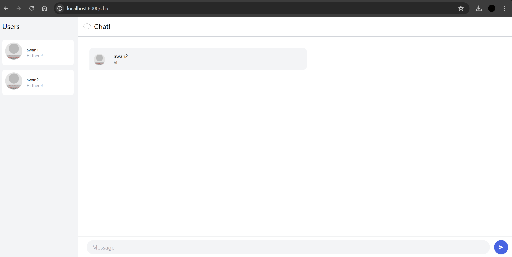
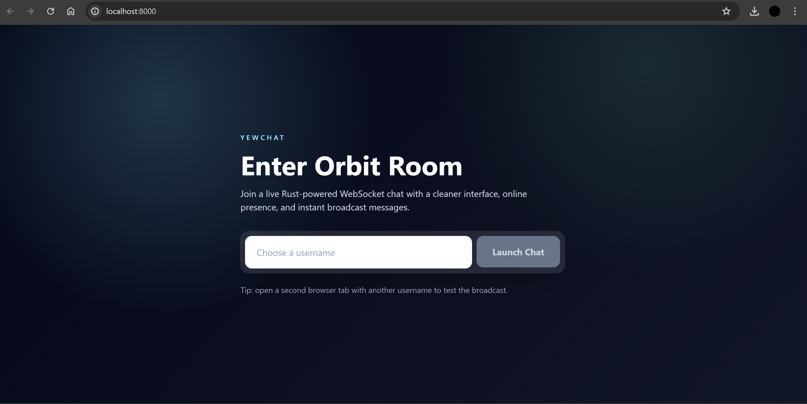
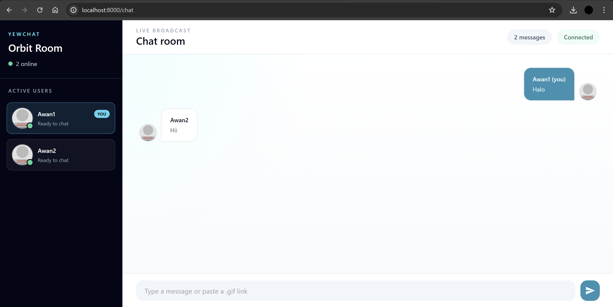
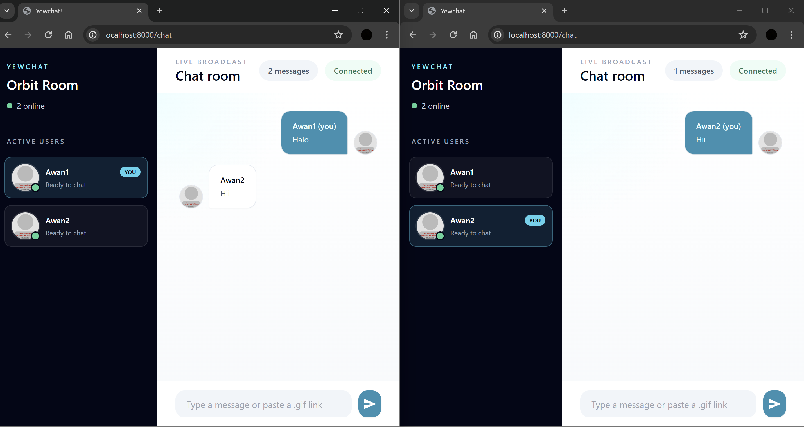

# Tutorial 3 - WebChat using Yew

## Experiment 3.1: Original code

Project ini menggunakan dua aplikasi dari referensi YewChat:

- `SimpleWebsocketServer`: WebSocket server berbasis NodeJS/TypeScript yang berjalan pada port `8080`.
- `YewChat`: web client berbasis Rust Yew yang berjalan pada port `8000`.

Server dapat dijalankan dengan perintah berikut:

```powershell
cd SimpleWebsocketServer
npm install
npm start
```

Client dapat dijalankan dengan perintah berikut:

```powershell
cd YewChat
npm install
npm start
```

Setelah kedua aplikasi berjalan, buka browser ke:

```text
http://127.0.0.1:8000/
```

Untuk mencoba chat, buka dua tab browser atau dua window browser ke alamat yang sama.
Masukkan username yang berbeda pada setiap tab, lalu kirim pesan dari salah satu tab.
Pesan akan dikirim dari Yew client ke WebSocket server pada `ws://127.0.0.1:8080`.
Server kemudian membroadcast pesan tersebut ke semua client yang sedang terhubung.

### WebSocket Server



Server berhasil berjalan pada port `8080`.
Pada screenshot, server menerima koneksi dari web client yang dibuka melalui browser.
Server ini bertugas menerima pesan dari satu client, menyimpan daftar user aktif, lalu mengirim update user dan pesan chat ke semua client yang terhubung.

### Client 1



### Client 2



Pada pengujian ini, dua client dibuka melalui browser dengan username `awan1` dan `awan2`.
Kedua username muncul pada daftar `Users`, sehingga koneksi WebSocket dan proses registrasi user berhasil.
Pesan yang dikirim dari `awan1` muncul di halaman chat dan juga terlihat oleh `awan2`.
Sebaliknya, pesan yang dikirim oleh `awan2` juga muncul pada client lain.
Hal ini menunjukkan bahwa web client Yew berhasil terhubung ke WebSocket server dan server berhasil melakukan broadcast pesan antar client.

## Experiment 3.2: Be Creative!

Pada eksperimen ini, saya mengubah tampilan web client YewChat agar terasa lebih modern dan informatif.
Login page diubah menjadi halaman masuk bertema `Orbit Room` dengan visual gelap, accent cyan, dan call-to-action yang lebih jelas.
Chat page juga diubah dengan sidebar gelap untuk daftar user aktif, indikator online, status koneksi, jumlah pesan, dan message bubble yang membedakan pesan milik user sendiri dengan pesan dari user lain.
Jika belum ada pesan, halaman chat menampilkan empty state sehingga area chat tidak terlihat kosong tanpa konteks.
Input pesan juga dibuat lebih jelas dengan placeholder yang memberi tahu bahwa pengguna bisa mengirim teks biasa atau link `.gif`.

Perubahan ini tetap mempertahankan fungsi utama aplikasi.
User masih login menggunakan username, client masih terhubung ke WebSocket server pada `ws://127.0.0.1:8080`, dan pesan tetap dibroadcast ke semua browser yang sedang terhubung.
Kreativitas difokuskan pada pengalaman pengguna: status online lebih mudah dibaca, pengguna dapat melihat dirinya sendiri dengan label `You`, dan pesan yang dikirim sendiri tampil di sisi kanan dengan warna berbeda.

### Login Page 3.2



### Chat Page 3.2



### Broadcast Test 3.2



Pada screenshot broadcast, dua browser dibuka berdampingan dengan user `Awan1` dan `Awan2`.
Masing-masing browser menampilkan label `You` pada user yang sedang aktif di browser tersebut.
Pesan dari `Awan1` dan `Awan2` tetap terkirim melalui WebSocket server dan muncul di client lain, sehingga perubahan visual tidak merusak fungsi broadcast chat.
